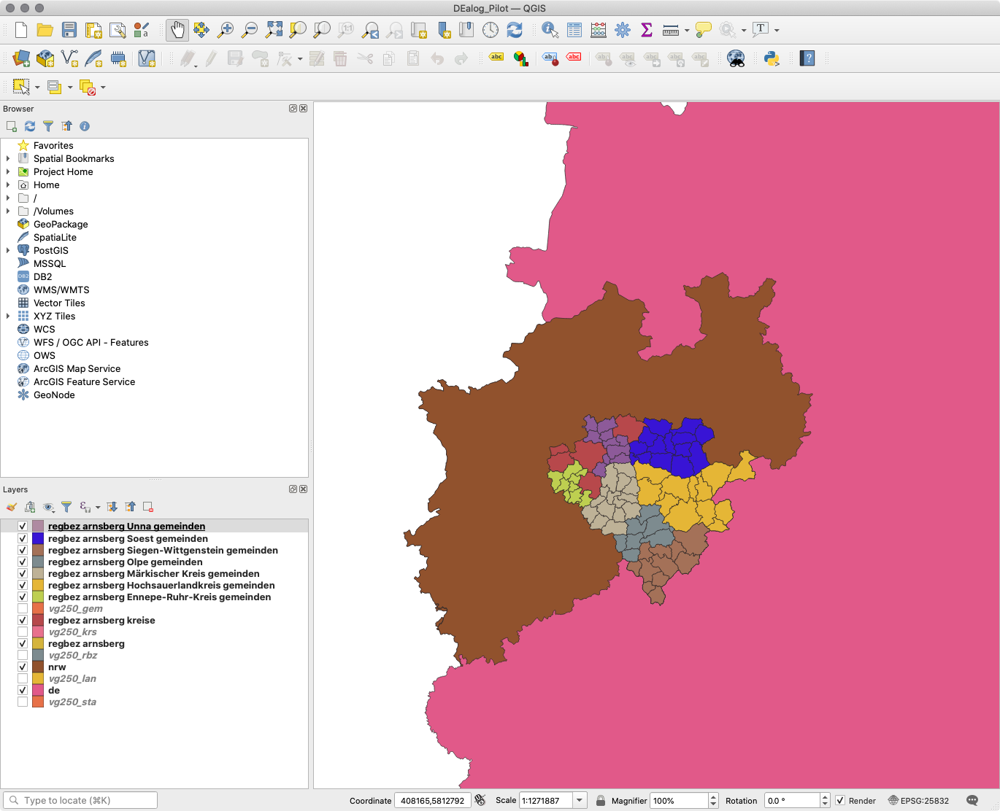

# PostGIS importer

This project contains an import for Verwaltungsgebiete data.

The used data is obtained from [Verwaltungsgebiete 1:250 000 (Ebenen), Stand 01.01.](https://gdz.bkg.bund.de/index.php/default/digitale-geodaten/verwaltungsgebiete/verwaltungsgebiete-1-250-000-ebenen-stand-01-01-vg250-ebenen-01-01.html)

## Usage

### Import data

> Note: This container is used to mainly convert and view the data.
> **DO NOT USE IN PRODUCTION**

- Build the Docker container

```bash
docker build -t dealog/postgis:latest .
```

- Start the Docker container

```bash
docker run\
  --name postgis_import\
  --rm\
  -d\
  -p 15432:5432\
  -e POSTGRES_DBNAME=postgis\
  -v ${PWD}:/app\
  dealog/postgis:latest
```

> The database user and password is the default `docker:docker`.

- Run the import script

```bash
docker exec postgis_import ./import_verwaltungsgebiete.sh
```

### View data

To view the data visually it's recommended to use the [QGIS viewer](https://qgis.org/en/site/).

When using this you need to add the PostGIS datasource.

For the DEalog pilot project the [DEalog_Pilot.qgz](DEalog_Pilot.qgz) file can be loaded.

It should look like this:



### Export data

The DEalog pilot project needs only a subset of the data which can be exported
with the following command (the argument is the ARS):

```bash
docker exec postgis_import ./export_csv_verwaltungsgebiete.sh 05911 05913 05914 05915 05916 05954 05958 05962 05966 05970 05974 05978
```

This will export given municipalities incl. supervising ones to `data/` as CSV files.

> The arguments are the rural districts (Landkreise).

## License

MIT
